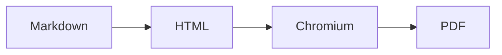

[[toc]]

# Markdown から提出用 PDF へ

これは **日本語** の Markdown を、ローカルフォントを使った PDF に変換するサンプルです。脚注も利用できます[^note]。

## 数式

インライン数式 $E = mc^2$ と、別行立ての数式に対応します。

$$
f(x) = \int_{-\infty}^{\infty} \hat{f}(\xi)e^{2\pi i x\xi}d\xi
$$

## コード

```ts
const greeting = (name: string) => `こんにちは、${name} さん`;
console.log(greeting("Codex"));
```

## Mermaid 図



<!-- pagebreak -->

## 表とチェックリスト

| 機能 | 状態 |
| --- | --- |
| GFM | 対応 |
| PDF 出力 | 対応 |

- [x] 目次
- [x] ページ番号
- [ ] 表紙テンプレート

<!-- pdf-ignore-start -->
この文章は PDF に表示されません。
<!-- pdf-ignore-end -->

[^note]: 脚注はページ下部に整形されます。
